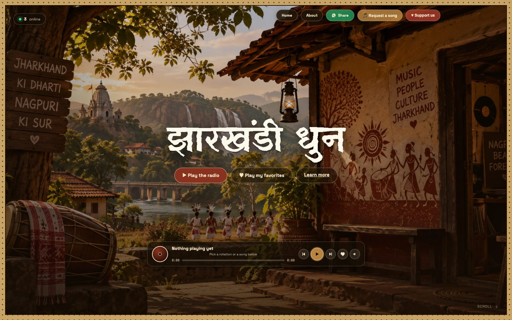
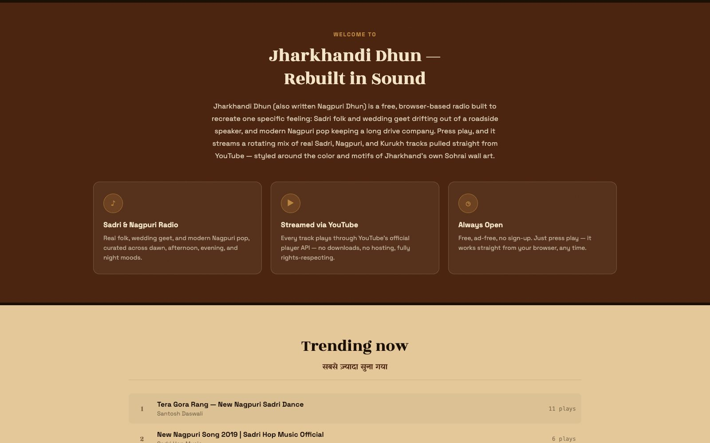
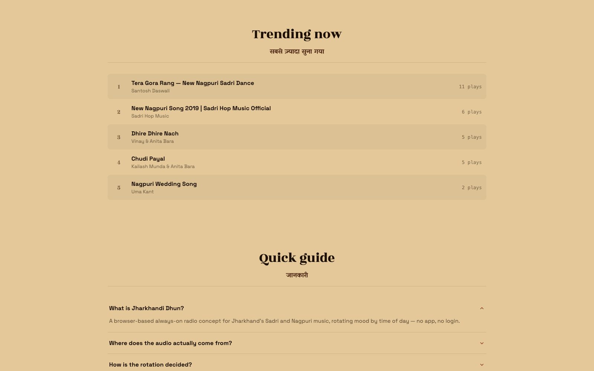
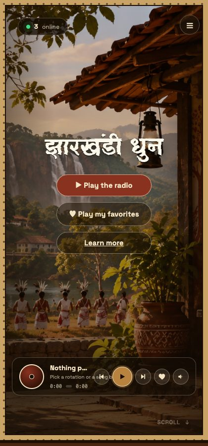

# झारखंडी धुन — Jharkhandi Dhun

**A free, always-on radio for Jharkhand's Sadri, Nagpuri, and Kurukh music.**

🔗 **Live site:** [pratik-8070.github.io/nagpuri-dhun](https://pratik-8070.github.io/nagpuri-dhun/)



Jharkhandi Dhun streams a rotating mix of real Sadri folk, wedding geet, and modern Nagpuri/Kurukh pop — no app, no sign-up, no ads. It's a single-page, single-file website styled after Jharkhand's own Sohrai/Khovar tribal wall-art tradition, with a real photo backdrop and a compact glass music player.

<table>
<tr>
<td></td>
<td></td>
</tr>
<tr>
<td align="center"><sub>Welcome section + feature cards</sub></td>
<td align="center"><sub>Real trending leaderboard</sub></td>
</tr>
</table>


<p><sub>Mobile view</sub></p>

## Features

**Playback**
- 🎵 **Real YouTube tracks** — every song streams through YouTube's official IFrame Player API, credited to its real singer/channel; nothing is downloaded or re-hosted
- 🕐 **Time-based rotation** — the catalog is split into four moods (dawn / afternoon / evening / night) and defaults to whichever matches the current time in IST
- 🎚️ **Full player controls** — play/pause, previous/next, a draggable seek bar, and a volume popup slider with mute
- ♥ **Favorites** — heart any track from the player; saved per-browser (no login needed), with a one-click "Play my favorites" queue

**Live, real data — nothing fabricated**
- 🟢 **Online now** — a real count of currently-connected visitors, via Firebase presence (auto-removed the instant a tab closes)
- 🎧 **Listening now** — how many visitors are actually playing something right now, and what most of them are hearing
- 🔥 **Trending now** — a top-5 leaderboard ranked by real play counts, tracked live in the database
- 🙋 **Song requests** — visitors submit a YouTube link + note for the owner to review; nothing is auto-added to the catalog, and requests aren't publicly readable

**Design**
- 🎨 A full-bleed real photo hero inside a hand-drawn, dotted Sohrai-style picture-frame border
- 🌗 Dark-glass floating UI (nav, buttons, player) over the photo, in a palette sampled directly from the hero image
- ✨ Staggered fade-in animation for the hero on page load (respects `prefers-reduced-motion`)
- 📱 Fully responsive, phone to desktop

**Sharing & support**
- 💬 One-tap **WhatsApp share** button (pre-fills the site link)
- ♥ **Support Us** modal with a real UPI QR code for donations

## Tech stack

- **Plain HTML/CSS/JS** — no build step, no framework, one `index.html` file
- **[YouTube IFrame Player API](https://developers.google.com/youtube/iframe_api_reference)** for playback
- **[Firebase Realtime Database](https://firebase.google.com/docs/database)** (free Spark plan) for live presence, now-playing, play counts, and song requests
- **[GitHub Pages](https://pages.github.com/)** for hosting

## Adding a song

Open `index.html`, find the `TRACKS` array near the top of the `<script>` block, and add a line:

```js
{ title: "Song Name", artist: "Channel Name", year: 2024, rotation: "evening", youtubeId: "abc123XYZ" }
```

- `youtubeId` is the `v=` value from any YouTube URL
- `rotation` must be one of `"dawn"`, `"afternoon"`, `"evening"`, `"night"`

Commit and push — GitHub Pages redeploys automatically within about a minute.

## Reviewing song requests

Submitted requests aren't publicly readable (to keep them private between visitor and site owner). Check them in the [Firebase console](https://console.firebase.google.com/project/nagpuri-dhun/database/nagpuri-dhun-default-rtdb/data) under the `requests` node.

## Running locally

It's a static file — just open `index.html` in a browser, or serve the folder with any static file server:

```bash
python3 -m http.server 8000
```

## Disclaimer

This is a template/passion project. Playback is delivered entirely by YouTube under its own terms; this site does not host, download, or redistribute any audio or video. Track titles, artists, and years are shown as credited on YouTube and may be incomplete or approximate.

---

Built with [Claude Code](https://claude.com/claude-code).
